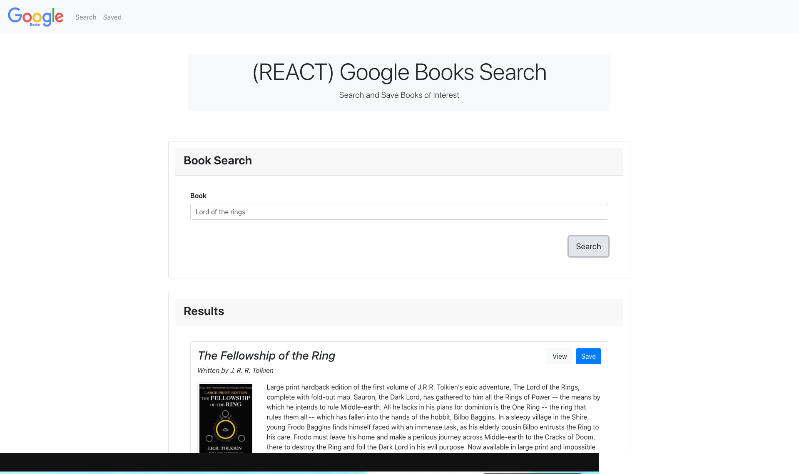

# Google-Books-Search-App

  


  ## Description
  An Google-Books-Search is an APP that features dynamically updated HTML and CSS using JavaScript (REACT). The user is allowed to search books, view book details on Google Books via external link, and save the interested books for future reference.
 



  ## Table of contents
  
  * [Installation](#installation)
  * [Usage](#usage)
  * [License](#license)
  * [Contributing](#contributing)
  * [Questions](#questions)

  ## Installation

  The user needs to run:

    ```
    npm install
    ```
  in the command line in order to install the required dependencies for this app on your system. In order to run this app please type in the command line and execute:
    ```
    npm start
    ```
  This app has also been deployed online, please click [here](https://guedesantonio.github.io/Google-Books-Search/) and start using it.

  ## Usage
  
  Open the application on the link above. When the user loads the page, a Search page should load.
  
  The user should be able to:

    * Type in a book title in search field, and click search.

    * Please note: this application only supports search by 'book title'.

    * Results will display below search field.

    * Click VIEW to review details on Google Books.

    * To save books, click SAVE.

    * To view saved books, goto SAVED in navbar.

    * To delete books, click DELETE.
  

  ## License
  This project is licensed under the MIT.

  ## Contributing
  See [Questions](#Questions) section.

  ## Questions
  If you have any questions about the repo, open an issue or contact me directly at gguedesantonio@gmail.com. 
  You can find more about my work at [Github profile](https://github.com/guedesantonio).